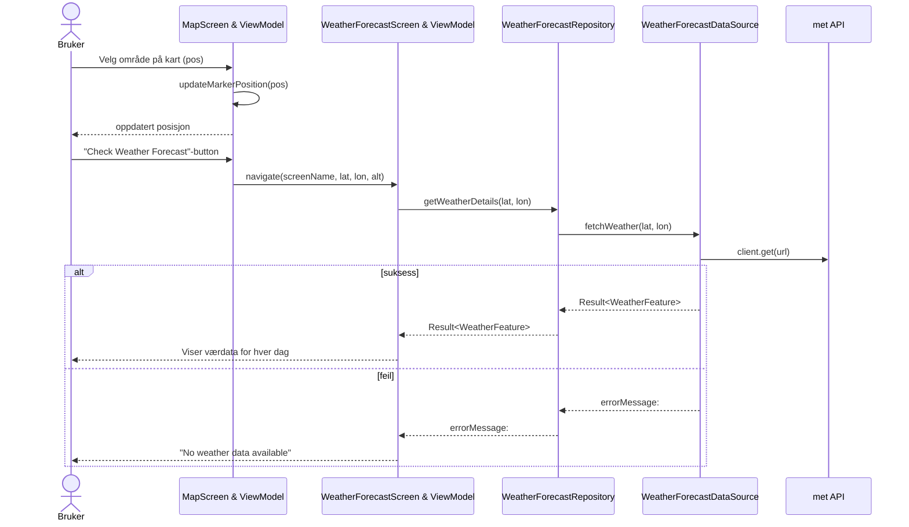
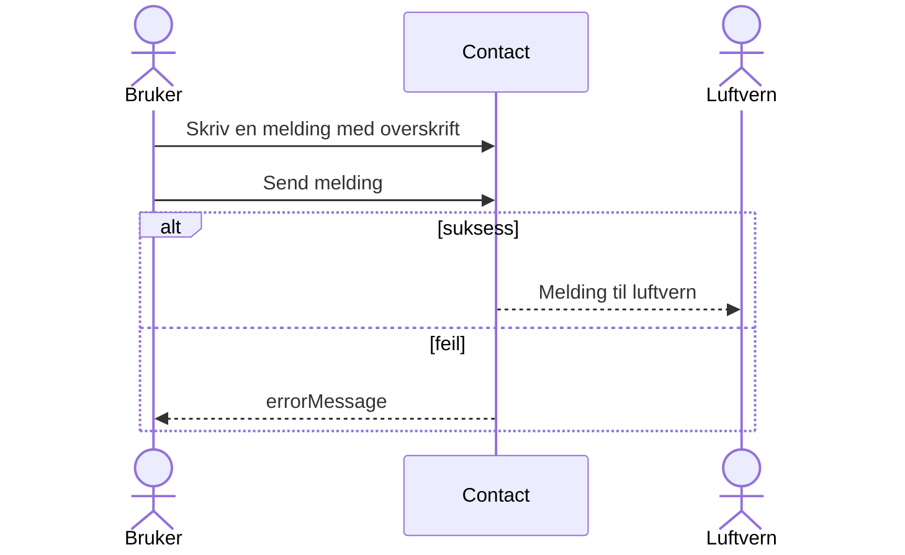
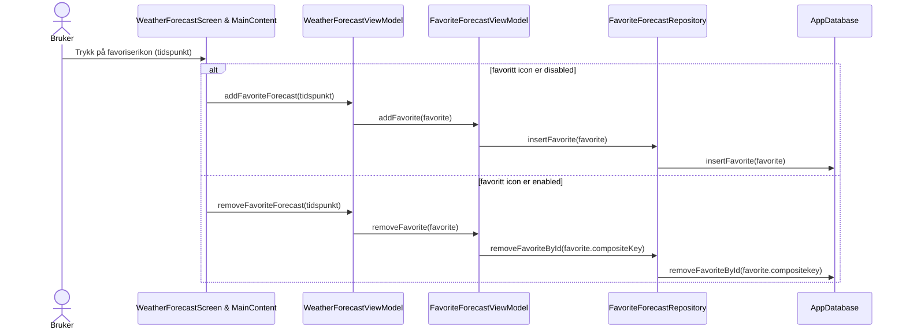
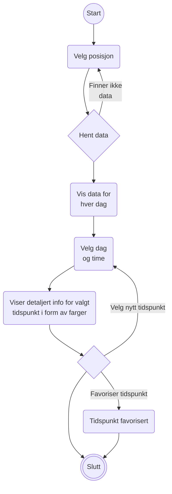
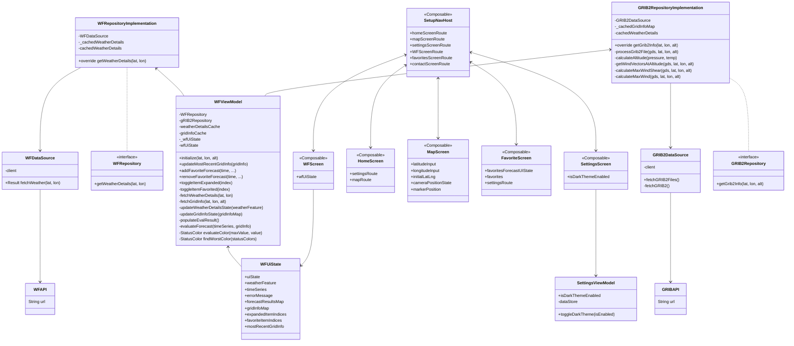
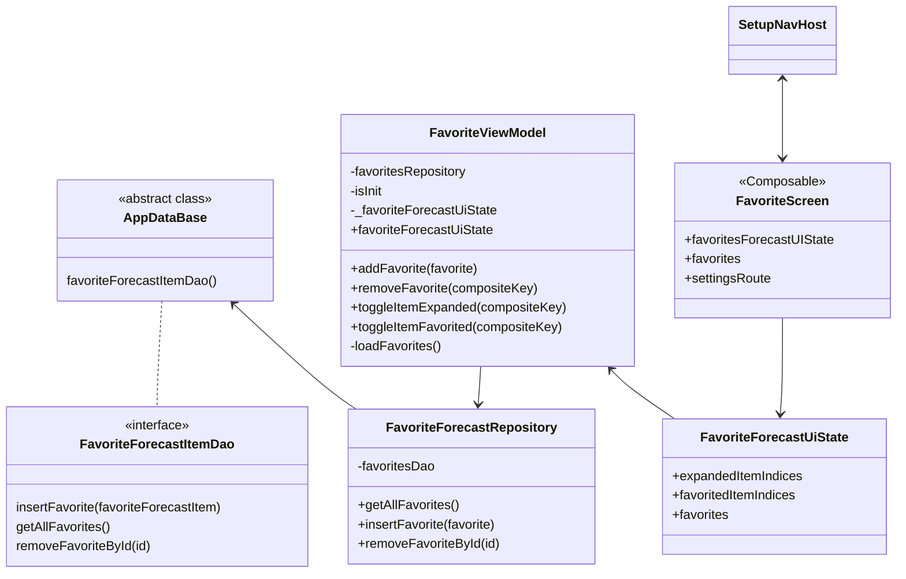

### Funksjonelle krav:
 -Vi skal lage en oppsummeringsside der bruker får en rask tilbakemelding på om det er ønskelig og lovlig å sende opp en rakett.\
 -Vi skal lage funksjonalitet for å se mer detaljert om vær på posisjonen.\
 -Vi skal lage funksjonalitet for å endre og justere størrelsen på raketten for mer detaljerte tilbakemeldinger ved de andre kravene.\
 -Lage funksjonalitet for å kontakte luftverns-tilsynet.
 
### Use Case:

#### 1. Vi skal lage en oppsummeringsside der bruker får en rask tilbakemelding på om det er ønskelig og lovlig å sende opp en rakett:
##### Tekstlig beskrivelse av Use Case - _"Rask tilbakemelding":_

 Aktører:\
 -Bruker\
 -Meteorologisk institutt - API
 
 Prebetingelser:\
 -Bruker er pålogget applikasjonen.\
 -Området har data om værforhold\
 -Bruker har et ønsket område for oppskytning
 
 Postbetingelser:\
 -Presentere oppskytningstider til den eksterne brukeren for å gi rask tilbakemelding.
 
 Hovedflyt:
 1. Bruker velger ønsket område for oppskytning (ved longitude og latitude eller på kart).
 2. Systemet gir kort oppsummering av været for de neste dagene.
 3. Bruker kan trykke på dager og enkelt se oppsummert farge for hver tid
 
 Alternativflyt:\
 2.1 Systemet mangler data.\
 2.2 Bruker blir bedt om å velge et nytt området.
 
#### 2. Vi skal lage funksjonalitet for å se mer detaljert om vær på posisjonen.
##### Tekstlig beskrivelse av Use Case - _"Område valgt på kart":_

 Aktører:\
 -Bruker\
 -Meteorologisk institutt - API
 
 Prebetingelser:\
 -Bruker er pålogget applikasjonen.\
 -Søknaden om rakettoppskytning er opprettet av brukeren.
 
 Postbetingelser:\
 -Velge område på et kart for så å vise detaljert informasjon om værforholdene i det valgte området, samt vise om området er lovlig
 
 Hovedflyt:
 1. Bruker logger inn på applikasjonen.
 2. Bruker velger ønsket område for oppskytning.
 3. Systemet henter data for hver dag den neste uken
 4. Bruker velger dag
 5. Systemet viser farge og minimal data for hver time den valgte dagen
 6. Bruker velger en time
 7. Systemet genererer en side med med fargekode for valgt område på bestemt dato og tid:
 8. For hver tid vises detaltjert info om hvert kriterie for godkjent oppskytning som f.eks. wind og humidity\
       -Værforhold på ønsket område\
         Grønn: bra forhold\
         Gul: middels forhold\
         Rød: dårlige forhold (ikke godkjent oppskytning)
 
 Alternativflyt:\
 2.1. Systemet mangler data for ønsket område\
 2.2. Brukeren blir bedt om å velge et annet område for oppskytning.
 
#### 3. Vi skal lage funksjonalitet for å endre og justere størrelsen på raketten for mer detaljerte tilbakemeldinger ved de andre kravene.
##### Tekstlig beskrivelse av Use Case - _"Endre spesifikasjoner på rakett":_

 Aktører:\
 -Bruker
 
 Prebetingelser:\
 -Bruker er pålogget applikasjonen.
 
 Postbetingelser:\
 -Endring av rakettens spesifikasjoner blir registrert og tatt med i beregningen av de andre funksjonelle kravene
 
 Hovedflyt:
 1. Bruker legger inn spesifikasjoner for raketten
 
#### 4. Lage funksjonalitet for å kontakte luftverns-tilsynet
##### Tekstlig beskrivelse av Use Case - _"Kontakt med luftvern-tilsyn"_:
 
 Aktører:\
 -Bruker\
 -Luftverns-tilsynet
 
 Prebetingelser:\
 -Bruker er pålogget applikasjonen.
 
 Postbetingelser:\
 -Bruker har opprettet kontakt med luftverns-tilsynet
 
 Hovedflyt:
 1. Bruker trykker på knapp for å kontakte luftverns-tilsynet
 2. Bruker skriver en melding med en overskrift
 3. Systemet genererer en e-post klar til å sendes til luftverns-tilsynet
 4. E-post om ønsket oppskytning sendes til luftverns-tilsynet
 
 Alternativflyt:
 
### Diagrammer
 
###### Sekvensdiagram - Visning av værdata
###### _Dette sekvensdiagrammet viser hva som skjer når bruker velger posisjon på et kart, og værdataen vises for bruker. For bedre lesbarhet er Screen og ViewModel kombinert. Diagrammet viser kun hva som skjer for WeatherForecast og ikke GRIB2._

###### Sekvensdiagram - Kontakt luftvern
###### _Dette sekvensdiagrammet viser funksjonaliteten for kontakt med luftverntilsynet_

###### Sekvensdiagram - Favoritt
###### _Dette sekvensdiagrammet viser funksjonaliteten for favorisering av tidspunkt_

###### Aktivitetsdiagram - Bruk av hovedfunksjonalitet

###### Klassediagram
###### _Dette er klassediagrammet for de viktigste klassene i appen. For lettere lesbarhet er noen klasser ikke inkludert, favoritescreen kommer etter som en egen del. (WF: forkortelse for WeatherForecast)._

